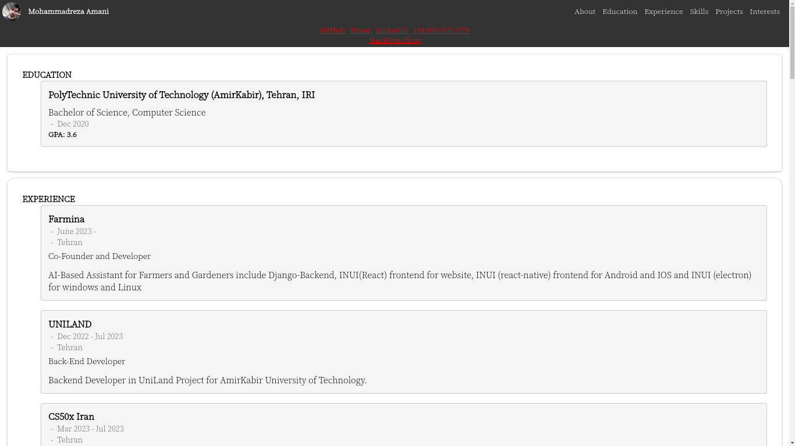
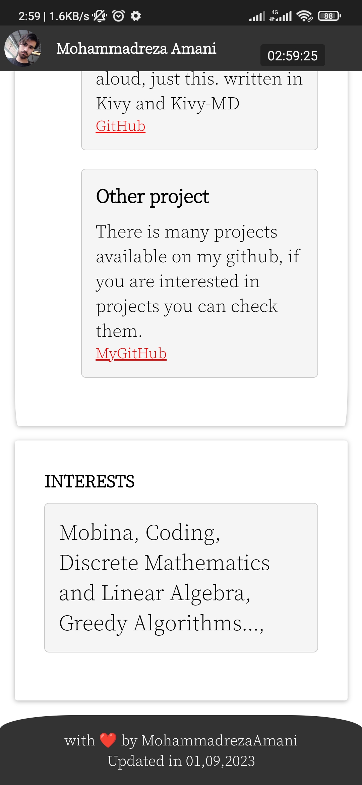

# CV Template - INUI

Simple CV Template written in pure `INUI`.

### How To Use?

- install `INUI`:
```bash
python3 -m pip install inui
```

- clone repository

```bash
git clone git@github.com:MohammadrezaAmani/MohammadrezaAmani.github.io.git
```
- open `MohammadrezaAmani.github.io` and fill `data.py` with your resume, you can find example in `data.example.py`

# How To Fill The Data?

There is 11 Parts that you need to fill:
```python
NAME = "Mohammadreza Amani"

TITLE = "%s- Resume" % NAME
DESCRIPTION = "Resume of %s" % NAME
PICTURE = "https://avatars.githubusercontent.com/u/64687226?v=4"
LANG = "en"
EDUCATIONS = [
    Education(
        "PolyTechnic University of Technology (AmirKabir)",
        "Bachelor of Science",
        "Tehran, IRI",
        "Dec 2020",
        "Computer Science",
        "GPA: 3.6",
    )
]
SKILLS = [
    Skill(
        "Languages", "Python, Go, Rust, C, C++, Java, Bash, SQL, JavaScript, LATEX..."
    ),
    Skill(
        "Development",
        """Django, DRF, Docker, K8s, INUI, Redis, Celery, MongoDB, PostgrSQL, RabbitMQ, NginX, FastAPI, HTML, CSS, React, Bootstrap, Foundation, Next.js, Gin, ORM. Git, GitHub""",
    ),
]
EXPERIENCES = [
    WorkExp(
        "Farmina",
        "Co-Founder and Developer",
        "June 2023 - ",
        "Tehran",
        """AI-Based Assistant for Farmers and Gardeners include Django-Backend,
        INUI(React)
        frontend for website, INUI
        (react-native) frontend for Android and IOS and INUI
        (electron) for
        windows and Linux""",
    ),
    WorkExp(
        "UNILAND",
        "Back-End Developer",
        "Dec 2022 - Jul 2023",
        "Tehran",
        "Backend Developer in UniLand Project for AmirKabir University of Technology.",
    )
]


PROJECTS = [
    Project(
        "INUI",
        """Powerful and Highly Customizable Python FrameWork for UI, It’s
        allow Back-
        End developer and everyone who
        knows python, write full Front-End of their applica-
        tion or
        websites using python Quickly.""",
        "https://github.com/MohammadrezaAmani/INUI",
    ),
    Project(
        "Farmina",
        """AI-Based Assistant for Farmers and Gardeners include
        Django-Backend,

        INUI(React) frontend for website, INUI (react-native) frontend for
        Android and IOS
        and INUI (electron) for
        windows and Linux""",
        linktext="not available",
    ),
]

LINKS = [
    Links(" GitHub ", "https://github.com/MohammadrezaAmani"),
    Links(" Email ", "mailto:more.amani@yahoo.com"),
    Links(" LinkedIn ", "https://www.linkedin.com/in/mohammadreza-amani/"),
]
INTERESTS = Interests(
    [
        "Mobina",
        "Coding",
        "Discrete Mathematics and Linear Algebra",
        "Greedy Algorithms...",
    ]
)
```

### output


